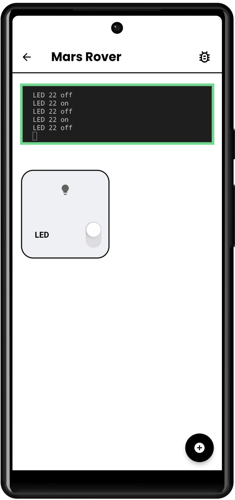
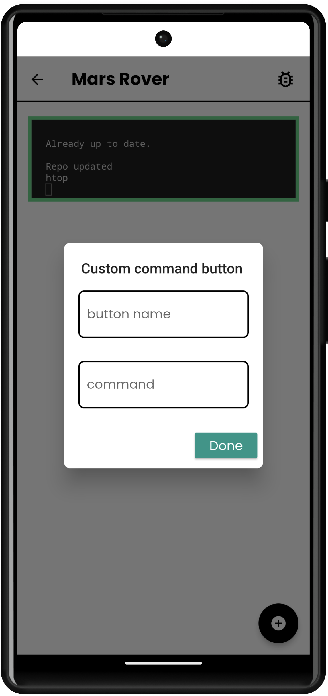
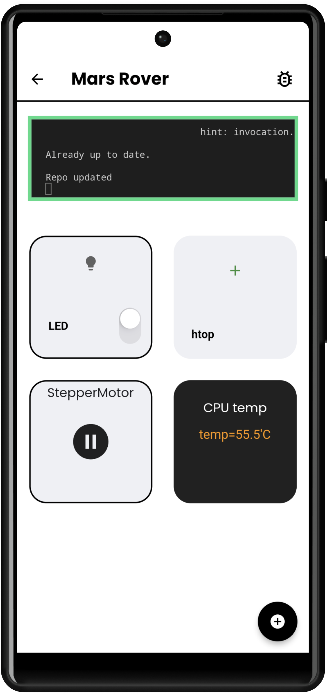
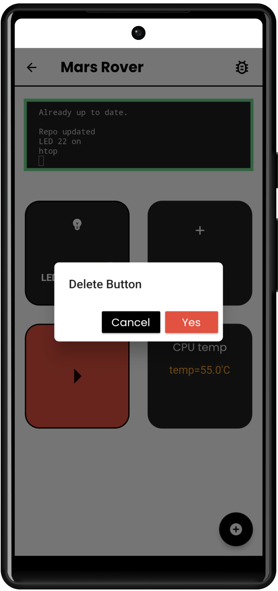

# Enter a space
By pressing on a space, you will enter (open) a space. 

On app bar, you can see the space name.
Right below, you will see a 3-dot widget and a black screen. That is the [comfyScript]() widget and a terminal. 
The comfyScript widget searches for and update the comfyScript folder in your Raspberry Pi. After the update is finished, the comfyScript widget will disappear and report completion to the terminal.  
***This is not something to concern about, if curious: learn more about [comfyScript]()*** 

 
A terminal is a screen to tell you what's happening: a button is pressed, data is accessed, comfyScript is updated, etc. This is useful for bebugging. 

 

Lastly, the floating + button allows you to add a new button to your space 

 

# Button Functionality
Each buttons have its own functionality, but they either send a command or receive/display a stream of data (sensor, system usage, etc.) 

 
You can press & hold to delete a button 
 
See available buttons in [button list]()