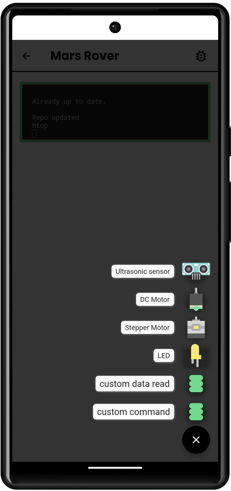
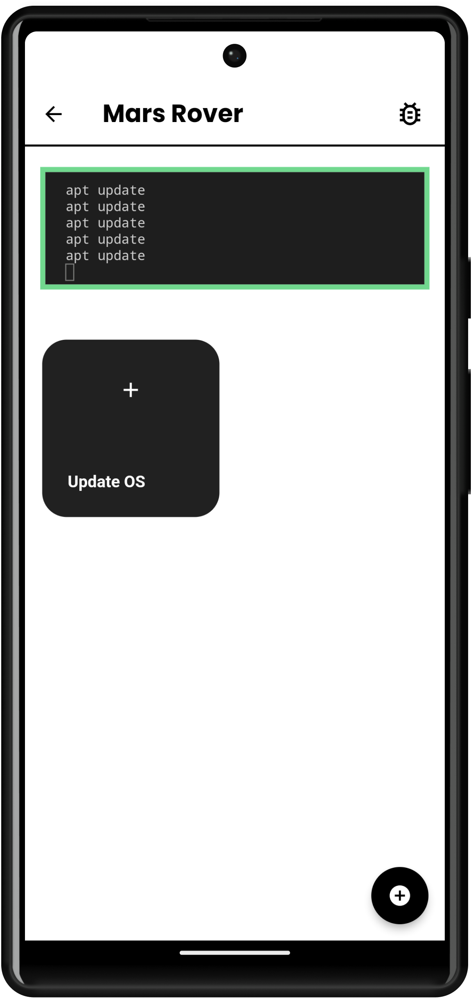
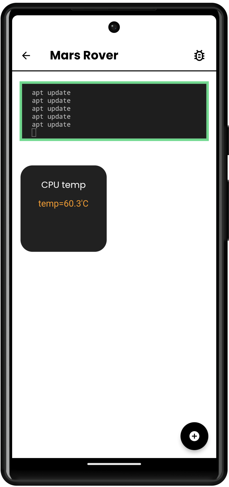
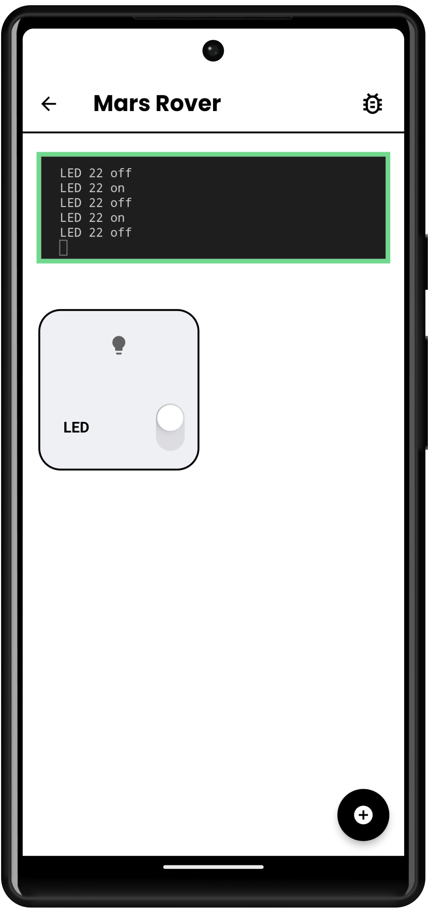
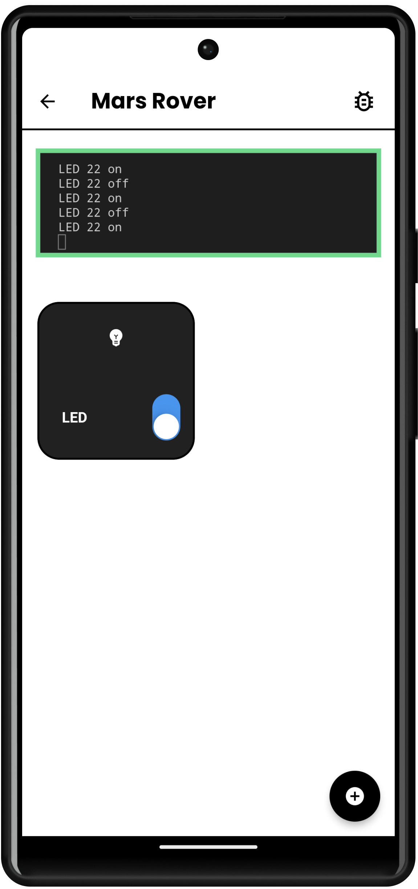
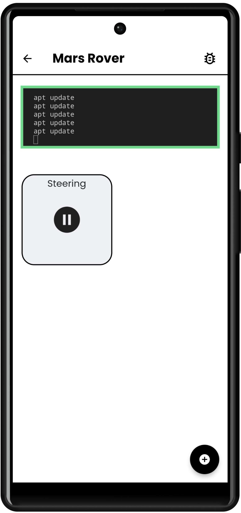
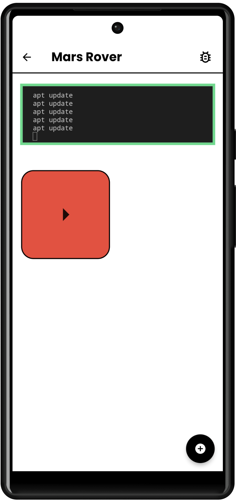
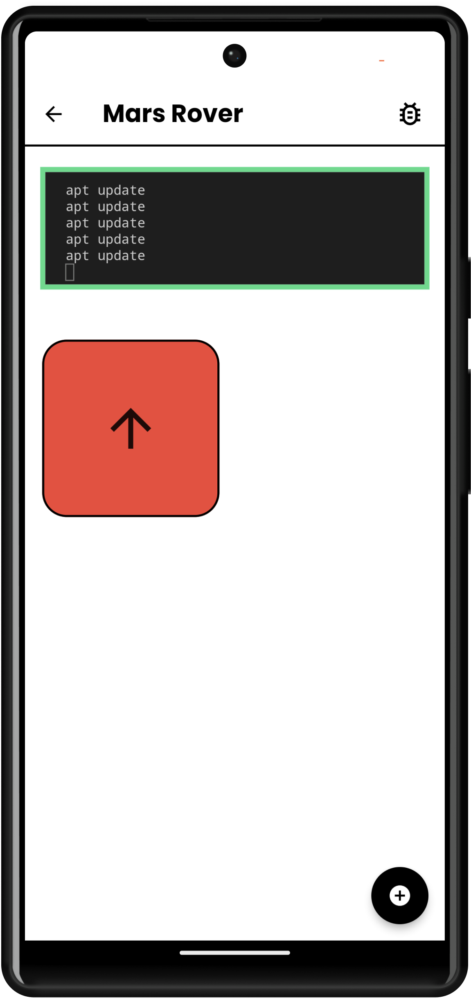
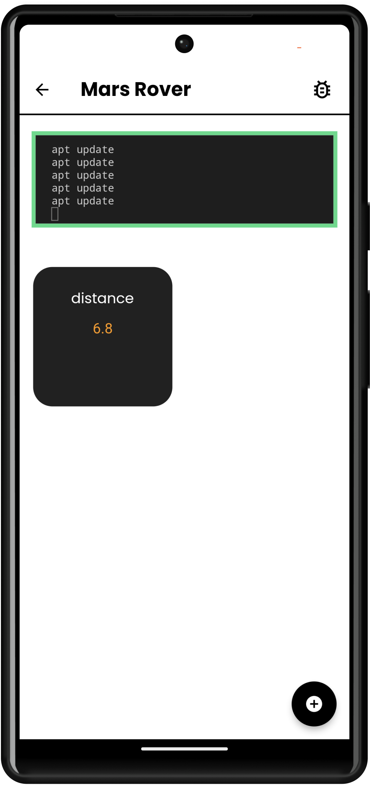
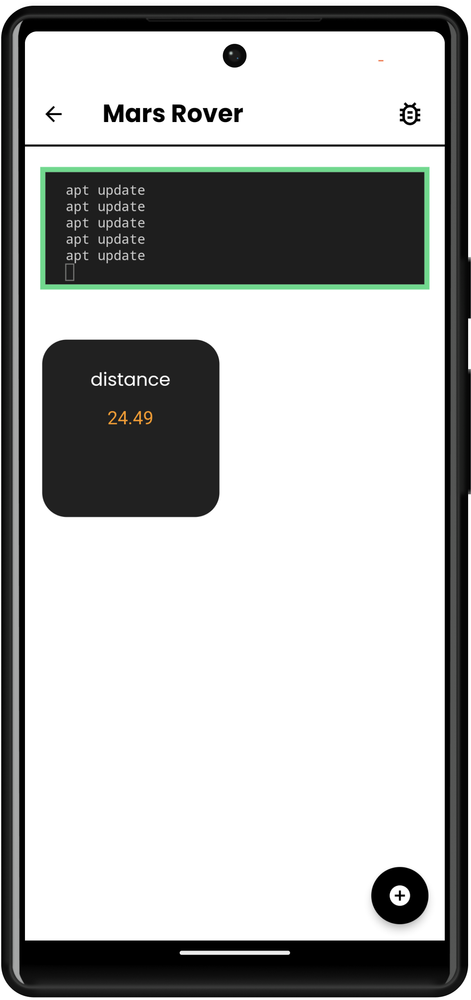

# Custom command button (comfy button)

The first, the original, and my personal favorite - ***the comfy button***

Just as the name describes, this button sends a command when pressed 
To add a ***comfy button***, enter a button name and command 

 

# Custom data read button

This button allows you to continously read data from a command. This is useful for sensors and information-sending components. 
To add a ***custom data read button***, enter a button name and command 

 

# LED button

This button allows you to toggle an LED 

 

# Stepper Motor button

This button allows you to control a stepper motor  
There are 3 states: 
- Pause: Pause the stepper motor by tapping/pressing
- Counterclockwise: Move the stepper motor counterclockwise by swiping left
- Clockwise: Move the stepper motor clockwise by swiping right 

 

# DC motor button

This button allows you to control a DC motor  
There are 3 states: 
- Pause: Pause the DC motor by tapping/pressing
- Counterclockwise: Move the DC motor counterclockwise by swiping down
- Clockwise: Move the DC motor clockwise by swiping up 

 

# Distance sensor

This button allows you to ***continously*** read info from distance sensors  

 