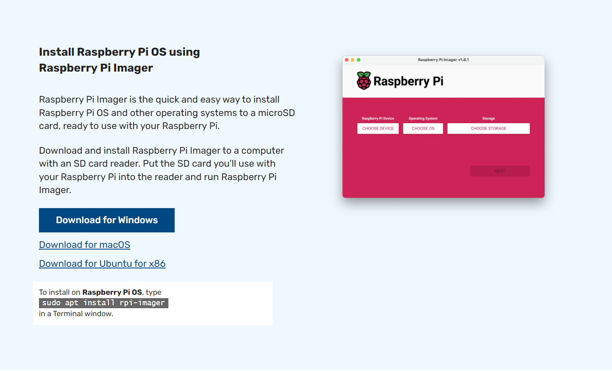

# Raspberry Pi setup

***Requirements: A Windows, Mac, or Linux computer***

First, download [Raspberry Pi Imager](https://www.raspberrypi.com/software/) to your computer, install, and run it.

Next, plug in your SD Card / USB drive and pick any Raspberry Pi OS and of your choice in the app.

Lastly, add Raspberry Pi SSH and wifi information. 

Save this information, you will need it later

Congrats! Your Pi is Comfy-ready. 

Lastly, <a href='/docs/Download'>***install***</a> Comfy Space.

Plug in your Raspberry Pi and move onto the next step.

***Note: If you already have a Raspberry Pi with known SSH credentials, skip this step***

