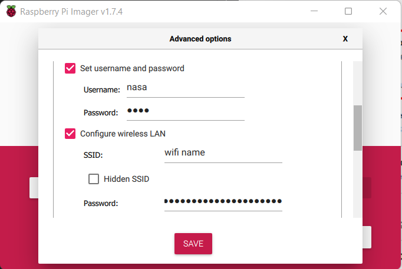

# Raspberry Pi setup

***Requirements: A Windows, Mac, or Linux computer***

1. Download [Raspberry Pi Imager](https://www.raspberrypi.com/software/)

2. Insert an SD card or USB into your computer

3. Open Raspberry Pi Imager & select Raspberry Pi OS

4. Choose the SD card/USB

5. Set up SSH & Wifi credentials

***Save this information, you will need it later***

Congrats! Your Pi is Comfy-ready. 

Lastly, <a href='/download'>***install***</a> Comfy Space.

Plug in your Raspberry Pi and move onto the next step.

