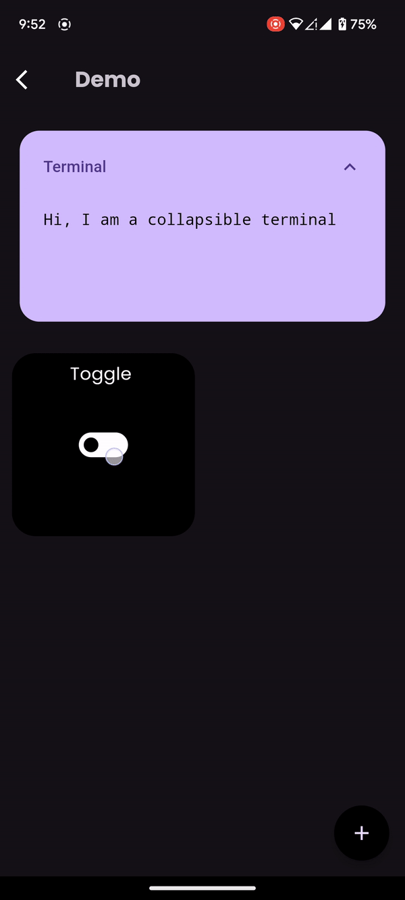
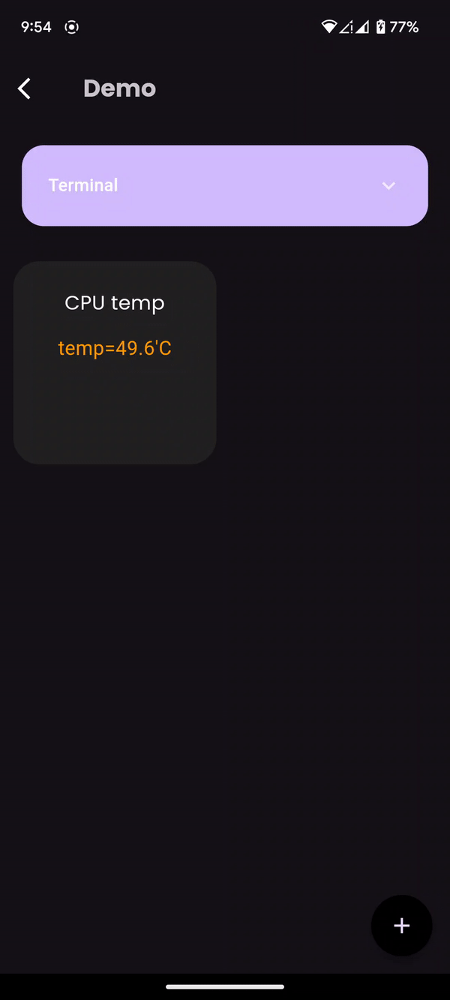

# Custom buttons

Gesture buttons allow users to control various functions or execute commands using different gestures such as swiping, tapping, or toggling. 
You can use any programming language (Python, bash or [comfyScript](https://github.com/ThomasVunguyen/comfyScript), etc.) along with it.

***This is great for more custom/complex projects!***

    
Tap button

***To create: Press +, enter a command, press done.***

***To use: Press it and a command will be executed.***

</img>

    
Toggle button

A toggle buttons with 2 commands for 2 toggle states.

***To create: Press +, enter 2 commands (for on & off), press done.***

***To use: Tap to toggle on/off, executing respective commands.***

</img>

    
Horizontal Gesture button

Swipe left, right, and tap to execute a command. You can bind one command to each gesture.

***To create: Press +, enter 3 commands for the 3 gestures, press done.***

***To use:Now swipe left, right, and tap to make cool things happen!***

</img>

    
Vertical Gesture button

Swipe up, down, and tap to execute a command. You can bind one command to each gesture.

***To create: Press +, enter 3 commands for the gestures, press done.***

***To use: Now swipe top, down, and tap to see something happen!***

</img>

    
Data button

See and track any data in real time.

***To create: Press +, enter the command, press done.***

</img>

