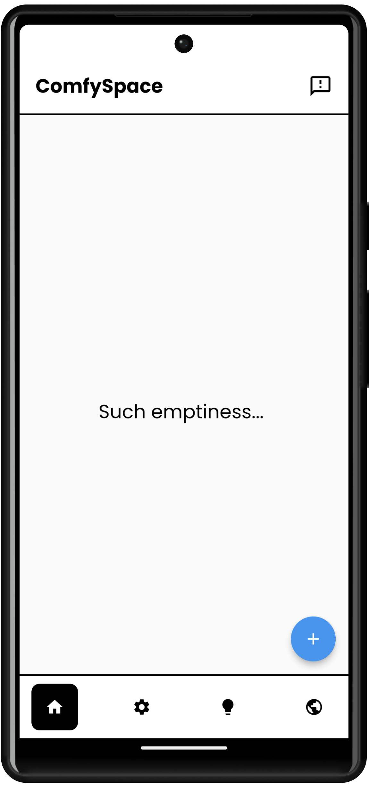
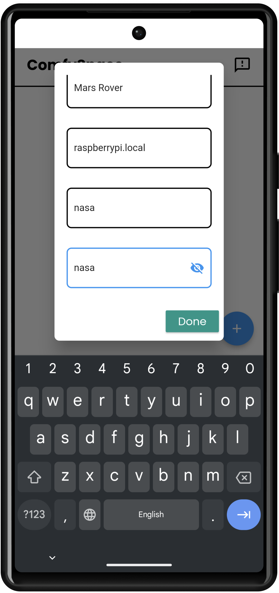
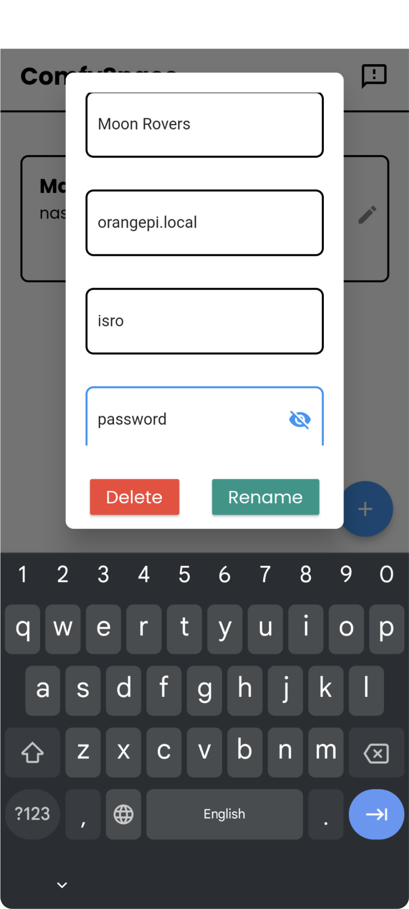

# What is a space?

A ***space*** is a collection of buttons to control and read information from a single Raspberry Pi. It looks like below. 
 
In this example, Mars Rover is your ***space name***, nasa is your ***username***, and raspberrypi.local is your ***hostname*** 

***Note: you can also use IP is hostname such as 192.168.0.1***

# Create a new space
When first opening the app, create a new space (by entering Raspberry Pi information) 

 
Congrats! You have create a new space. 
***Note: You can create multiple spaces with one Raspberry Pi***

You can also edit or delete a space 

//enter your space name, hostname, username, and password for SSH connection

Typically, this is the information setup in the Raspberry Pi Imager application.

//put raspberry pi setup link

# Edit a space

Press on the edit button to delete or edit information about a space

